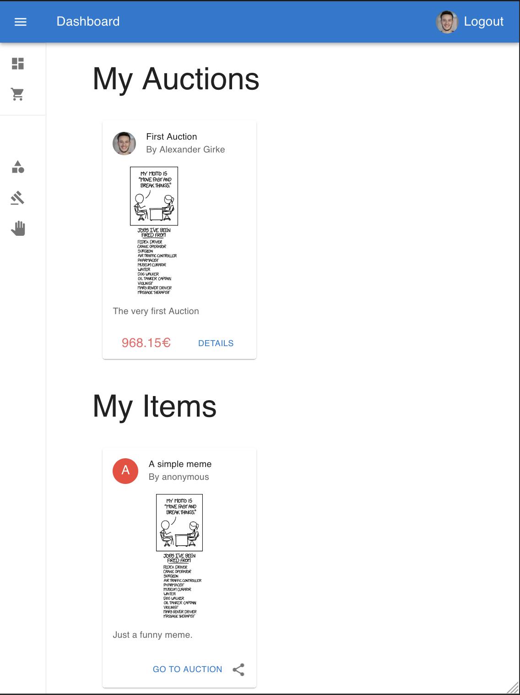
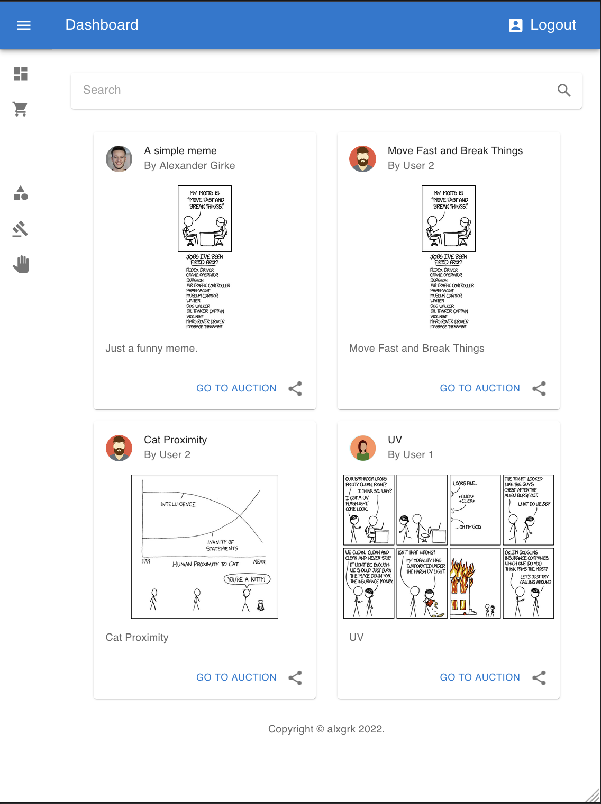
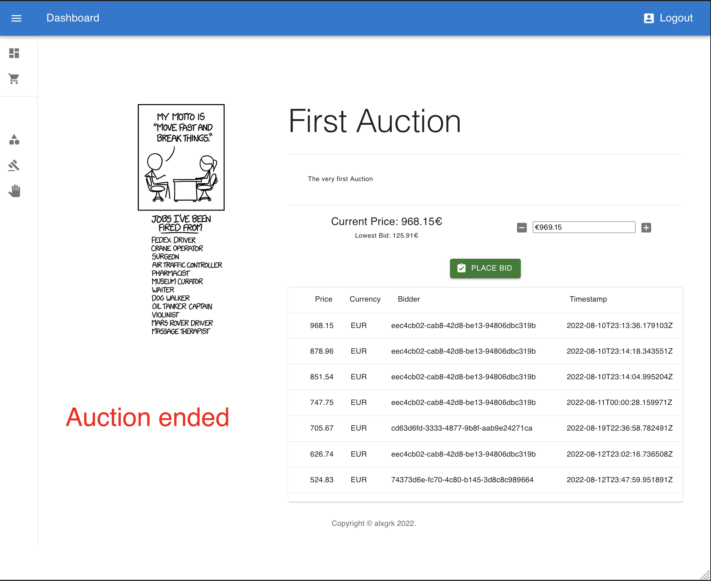
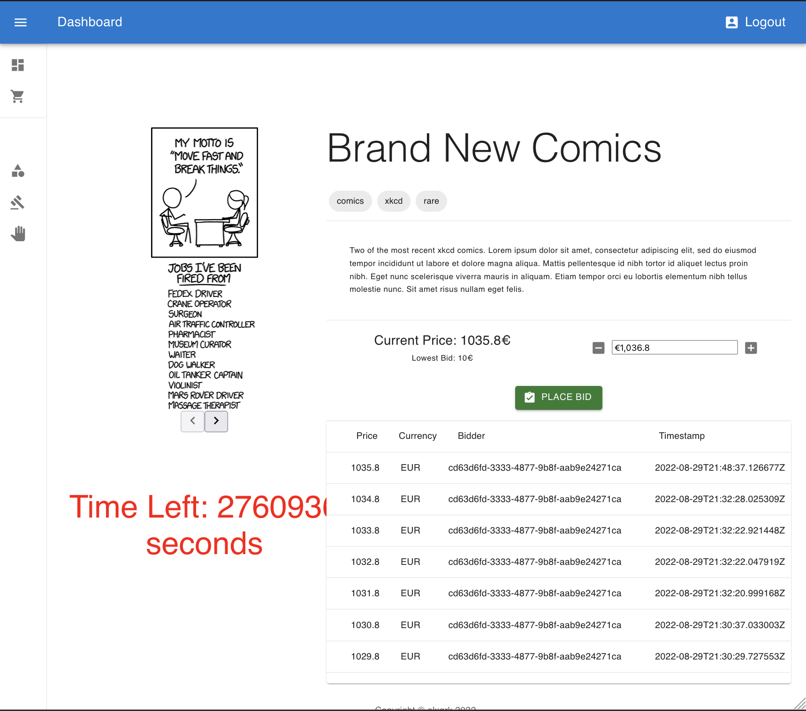

# Meme Auctioning System

Finally, you are able to sell your comics, memes and other artistic drawings on an auctioning platform.






## How it works

### How the data is stored:

Most of the data is stored as JSON in various keys and various data types.

```yaml
  Refresh Tokens:
     userId: like "cd63d6fd-3333-4877-9b8f-aab9e24271ca"
     refreshToken: like "c3adfc0d-6eb6-40f7-8663-49896d0c1855"
     expiryDate: like 1662422171471

  Auctions:
     id: like "8b0be9f2-3bb0-4972-87c6-423a7073832f"
     start: like "2022-08-07T22:23:07Z"
     end: like "2022-08-10T22:23:07Z"
     items: like ["95069680-670a-40c6-8068-c6cdd2561932"]
     title: like "First Auction"
     description: like "The very first Auction"
     seller: like "cd63d6fd-3333-4877-9b8f-aab9e24271ca"
     lowestBid:
       amount: like 123.45
       currency: like "EUR'
     isClosed: like false

  Items:
     id: like "d6118270-8404-4560-bee9-50c32870dd69"
     title: like "Move Fast and Break Things"
     description: like "Move Fast and Break Things"
     image: like "https://imgs.xkcd.com/comics/move_fast_and_break_things_2x.png"
     owner: like "735db4d6-658d-4ea6-aeed-d0718e076d6a"
  
  Biddings: (where key has prefix 'biddings:' followed by auctionId)
    0:
     id: like "0fd70232-f0d4-4bd1-8e84-7eb236834b77"
     timestamp: like "2022-08-10T23:08:30.360812Z"
     amount: like 213.94
     currency: like "EUR"
     context:
       userId: like "eec4cb02-cab8-42d8-be13-94806dbc319b"
       auctionId: like "8b0be9f2-3bb0-4972-87c6-423a7073832f"
    1: {...}
    2: {...}
  
  Users:
     id: like "f76f89f0-aacf-4cb5-ab1a-4b7969364725"
     externalId: like "345678910"
     login: like "user3"
     name: like "User 3"
     email: like "user3@auction.com"
     authType: like "Github"
     avatarUrl: like "https://cdn2.iconfinder.com/data/icons/avatars-99/62/avatar-369-456321-512.png"
```

There is also a stream under `bids:all` that accept JSON data (same structure as 'bidding:*') and a simple key-value association in order to store the last read event id.

### How the data is accessed:

Jedis library is used to connect to Redis and all data access is encapsulated behind a repository at `{service}/src/main/kotlin/de/alxgrk/data/*.kt`.

Please see the commands there.

## How to run it locally?

### Prerequisites

   * Node - v17.5.0
   * PNPM - v7.9.1
   * Docker - v20.10.x

### Local installation

```shell
# add Github OAuth App client id and secret to .env.example
# after creating an app at https://github.com/settings/developers -> OAuth Apps

# you might need to change docker magic IP/DNS record depending on you OS
# * for Mac, you shouldn't have to change anything
# * for Linux, you must replace 'host.docker.internal' with '172.17.0.1' in .env.example & nginx.conf

# copy file
cp .env.example ./auctioning-service/.env
cp .env.example ./auth-service/.env
cp .env.example ./bidding-service/.env

# start the servers
docker-compose up -d
```

```shell
# Go to /frontend folder (`cd ./frontend`) and then:
pnpm i
pnpm run dev
```

## Deployment

To make deploys work, you need to create free account on [Redis Cloud](https://redis.info/try-free-dev-to)

### Google Cloud Run

[Insert Run on Google button](https://cloud.google.com/blog/products/serverless/introducing-cloud-run-button-click-to-deploy-your-git-repos-to-google-cloud)

### Heroku

[Insert Deploy on Heroku button](https://devcenter.heroku.com/articles/heroku-button)

### Netlify

[Insert Deploy on Netlify button](https://www.netlify.com/blog/2016/11/29/introducing-the-deploy-to-netlify-button/)

### Vercel

[Insert Deploy on Vercel button](https://vercel.com/docs/deploy-button)

## More Information about Redis Stack

Here some resources to help you quickly get started using Redis Stack. If you still have questions, feel free to ask them in the [Redis Discord](https://discord.gg/redis) or on [Twitter](https://twitter.com/redisinc).

### Getting Started

1. Sign up for a [free Redis Cloud account using this link](https://redis.info/try-free-dev-to) and use the [Redis Stack database in the cloud](https://developer.redis.com/create/rediscloud).
1. Based on the language/framework you want to use, you will find the following client libraries:
    - [Redis OM .NET (C#)](https://github.com/redis/redis-om-dotnet)
        - Watch this [getting started video](https://www.youtube.com/watch?v=ZHPXKrJCYNA)
        - Follow this [getting started guide](https://redis.io/docs/stack/get-started/tutorials/stack-dotnet/)
    - [Redis OM Node (JS)](https://github.com/redis/redis-om-node)
        - Watch this [getting started video](https://www.youtube.com/watch?v=KUfufrwpBkM)
        - Follow this [getting started guide](https://redis.io/docs/stack/get-started/tutorials/stack-node/)
    - [Redis OM Python](https://github.com/redis/redis-om-python)
        - Watch this [getting started video](https://www.youtube.com/watch?v=PPT1FElAS84)
        - Follow this [getting started guide](https://redis.io/docs/stack/get-started/tutorials/stack-python/)
    - [Redis OM Spring (Java)](https://github.com/redis/redis-om-spring)
        - Watch this [getting started video](https://www.youtube.com/watch?v=YhQX8pHy3hk)
        - Follow this [getting started guide](https://redis.io/docs/stack/get-started/tutorials/stack-spring/)

The above videos and guides should be enough to get you started in your desired language/framework. From there you can expand and develop your app. Use the resources below to help guide you further:

1. [Developer Hub](https://redis.info/devhub) - The main developer page for Redis, where you can find information on building using Redis with sample projects, guides, and tutorials.
1. [Redis Stack getting started page](https://redis.io/docs/stack/) - Lists all the Redis Stack features. From there you can find relevant docs and tutorials for all the capabilities of Redis Stack.
1. [Redis Rediscover](https://redis.com/rediscover/) - Provides use-cases for Redis as well as real-world examples and educational material
1. [RedisInsight - Desktop GUI tool](https://redis.info/redisinsight) - Use this to connect to Redis to visually see the data. It also has a CLI inside it that lets you send Redis CLI commands. It also has a profiler so you can see commands that are run on your Redis instance in real-time
1. Youtube Videos
    - [Official Redis Youtube channel](https://redison freeCodeCamp

